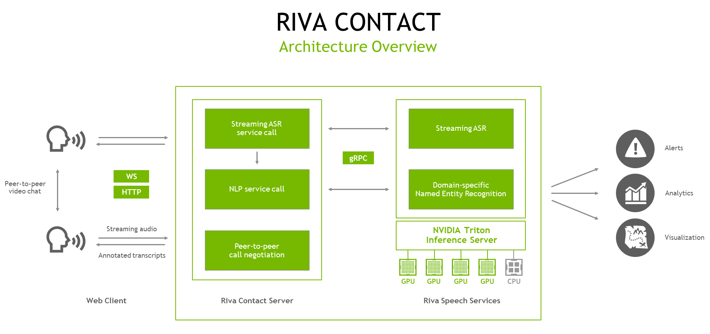

# Riva Contact

This Riva Contact Center Video Conference sample application is a web-based demonstration for contact center applications,
combining peer-to-peer video chat with streaming automatic speech recognition (ASR) and natural language processing (NLP). It is a
lightweight `Node.js` application, backed by NVIDIA Riva Speech services.


Users can chat using a direct, peer-to-peer WebRTC-based video connection. In the background, each user's web client sends a separate
audio stream to the Riva Contact server. The server makes a streaming gRPC call to hosted Riva AI Services, which return an
ongoing stream of ASR transcripts. This stream of transcripts is handed back to the speaker's web client, who can see how the
in-progress results can change as they speak.

When ASR results are marked as "final" (based on the ASR service's end-of-sentence detection settings, typically after short pauses
in speech), the server hands the resulting transcript over to the NLP service for named entity recognition (NER). If Riva is
configured to use a general-domain NER model, the service recognizes entities like the name of a *person*, *location*, or *organization*.
Riva can also be deployed with an NER model fine-tuned by NeMo for a specific domain. In this case, a model tuned on biomedical or
clinical language might recognize entities such as *problem*, *test*, or *treatment*.

After the NER results are complete, the Riva Contact server returns the final transcript, along with its NER annotation, back to
the web client, which exchanges transcripts with the other user for an ongoing, annotated transcript of the conversation.

This sample application offers a launching pad for your own development. For example, there are many possible applications which
use the transcripts and tagged entities for downstream analytics and visualization.



## Requirements and Setup

### Requirements

1. Riva Contact is a `Node.js` application, intended to run in a Linux environment.  You will need [`npm`](https://docs.npmjs.com/cli/v8/commands/npm-install) to install the application.

2. The application requires Riva Speech Services to run with two primary models:

* Streaming ASR
* Named Entity Recognition (NER)

You can use the default Riva models offered in the [Quick Start](https://docs.nvidia.com/deeplearning/riva/user-guide/docs/quick-start-guide.html) configuration, or you can deploy your own custom models trained using [NVIDIA TAO Toolkit](https://developer.nvidia.com/tao-toolkit) and import into Riva. Riva Contact comes pre-configured to use the models from the Riva [Quick Start Guide](https://docs.nvidia.com/deeplearning/riva/user-guide/docs/quick-start-guide.html).

### Installing the app


1. Clone Riva Sample Apps repository - [https://github.com/nvidia-riva/samples](https://github.com/nvidia-riva/samples)
```bash
git clone https://github.com/nvidia-riva/sample-apps.git
```
2. Enter Riva and Rasa Virtual Assistant directory:
```bash
cd sample-apps/riva-contact
```

3. Install the package
```bash
npm install
```

4. Riva Contact uses environment variables to manage its configuration parameters. These are kept in the config file [env.txt](./env.txt), where you will want to set the URL of your running Riva AI Services. You may also want to change the application’s ports, or the name of the NER model if you’ve deployed your own custom model in Riva.

5. (Optional) Depending on your server environment, you will likely also need to open two ports on the server (by default, ports 8009 and 9000). These ports are for the main entry point to the web application, and for the PeerJS server which helps to negotiate the peer-to-peer chat connections. You may also need to set up port forwarding for these in your router, if applicable.

## Running the Service
```bash
npm run start
```

This will start the `Node.js` application and will start listening for connections.

## Using the Service

1. Load the URL in a browser (Chrome or Firefox work well) on a computer with a webcam and microphone. For best ASR results, a
   headset is recommended.

   For example, if you're accessing the service from a computer within the local network, and it's hosted on a machine with the
   IP 192.168.2.10, then the URL would be <https://192.168.2.10:8009/>.

   The application includes a self-signed certificate for demo purposes which is likely to cause the browser to indicate a
   security warning. You can see the certificate in `riva-contact/certificates`.  To remove this warning, you can generate
   your own or buy one from a trusted signing authority. You can "accept the risk" and continue.

2. When asked, give the website permission to access your webcam and microphone. After the page is loaded, you're welcome to start
   the Riva transcription without needing to make a video call.

3. In the box titled *Riva transcription*, hit the **Start** button, then start speaking. You'll see in-progress transcripts in
   the text field at the bottom. As those transcripts are finalized, they'll appear with NLP annotations in the transcription box.
   To test the NLP directly (without speaking), simply type into the text field at the bottom and hit **Submit**.

   To call someone, you'll need their ID. Yours is the 4-digit number in the *Connection* box. It's random, and it changes every
   time the page is reloaded. Enter the ID of the person you want to call, and click **Call**. They will get a notification that
   a call is incoming, and will be asked to accept. After you're connected, Riva transcription will start automatically if it's
   not already running.

   The transcripts for each speaker are marked with the user's ID, or their display name if it has been set in the *Connection* box.

4. To end the call, simply click the **End** button.

## License
The [NVIDIA Riva License Agreement](https://developer.nvidia.com/riva/ga/license) is included with the product. Licenses are also available along with the model application zip file. By pulling and using the Riva SDK container, downloading models, or using the sample applications here, you accept the terms and conditions of these licenses.
