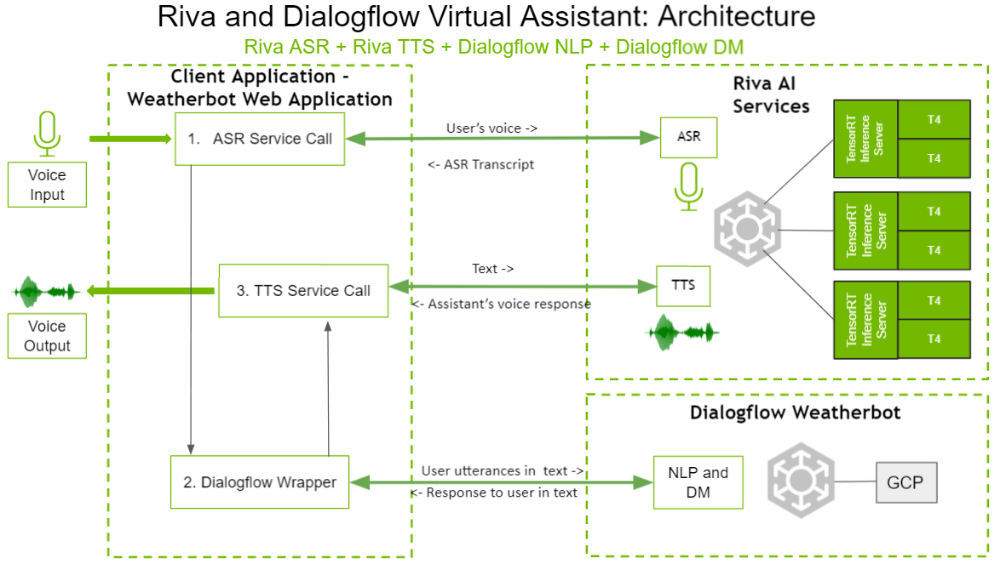

# Virtual Assistant (with Google Dialogflow)

This Virtual Assistant (with Google Dialogflow) sample application demonstrates the integration of Google Dialogflow and Riva Speech Services in the form of a weather chatbot web application.

In this sample, we use Riva for ASR and TTS and Google Dialogflow for NLP and Dialog Management (DM).

## Demo Video

To see how the Riva and Google Dialogflow weather chatbot service works, the demo video can be found [here](https://youtu.be/9pG8WDLjWMk).

## Implementation

At a high-level, the integration takes advantage of the native API support of Google Dialogflow and gRPC support in
Riva. The Weatherbot Client coordinates the workflow with Riva Services and Dialogflow, then interacts with the
end-user via a web UI. There are three primary parts to this solution; Riva AI Services, Dialogflow Weatherbot, and the Weatherbot Client
application.

Here is the implementation at a high-level:

- Riva AI Services
  - Exposes Speech Services (ASR/NLP/TTS) over gRPC endpoints.
  - Needs a GPU.

- Riva and Dialogflow Chatbot

  - Dialogflow Weatherbot
    - Exposes API endpoints to communicate with the chatbot.
    - Takes user text as input and returns a response.
    - Responsible for fulfillment, when needed.
    - Runs on GCP.

  - Weatherbot Client application
    - Includes the Riva Client Python library.
    - Communicates with Riva AI Services and Dialogflow Weatherbot over gRPC and REST API endpoints respectively.
    - Pipelines ASR, NLP, TTS, and dialog manager functionalities.
    - Contains the Weatherbot Client application (web UI and web service).
    - Does not need GPUs.

### Architecture



The above diagram shows the architecture of the Riva and Dialogflow Weatherbot. Audio input from the user is
collected through the microphone by the web UI of the Weatherbot Client application. The input audio from the user
is sent to Riva AI Services for ASR, by the client application. Riva AI Services returns the transcribed text
back to the Client application. The transcribed text from Riva AI Services is then sent to the Dialogflow Weatherbot
(running on GCP). The Dialogflow Weatherbot returns the appropriate response for the text. The response text is then
sent to Riva AI Services for TTS. A voice response is returned back to the client application, which is then played
on the user’s speakers by the web UI.

### Code Structure

This section shows the high-level code structure of the Weatherbot Client application (in
Riva and Dialogflow Chatbot).

- `asr.py`
  - This file contains the functionality to make the gRPC call to Riva ASR, using the Riva Python Client
    libraries with the audio snippet and returns the text transcript.
  - ASR is used in streaming mode

- `dialogflow.py`
  - This file contains the functionality to make an API call to Dialogflow, with the user input and sender ID
    and returns a text response obtained by Dialogflow.

- `tts.py` and `tts_stream.py`
  - These files contain the functionality to make the gRPC call to Riva TTS, using the Riva Python Client
    libraries, with a text snippet, and returns the corresponding audio speech.
  - TTS can be used in either Batch or Streaming mode, depending on whether `tts.py` or `tts_stream.py` is used.
    This can be set by changing the import statements in lines 12 and 13 in the `virtual-assistant-dialogflow/dialogflow-riva-weatherbot-webapp/riva/chatbot/chatbot.py` script.

- `chatbot.py`
  - This file contains the Chatbot class which is responsible for pipelining all the ASR, TTS and Dialogflow
    operations.
  - Creates one instance of the Chatbot class per conversation.

## Requirements and Setup

### Requirements: 
Before you try running the Riva client, ensure you meet the following requirements:
1. You have access and are logged into NVIDIA NGC. For step-by-step instructions, refer to the [NGC Getting Started Guide](https://docs.nvidia.com/ngc/ngc-overview/index.html#registering-activating-ngc-account).
2. [Python 3](https://www.python.org/download/releases/3.0/)  

### Setup:  

1. Clone Riva Sample Apps repository:
```
	git clone https://github.com/nvidia-riva/sample-apps.git
```

2. Enter Riva and Dialogflow Virtual Assistant directory:  
```
	cd sample-apps/virtual-assistant-dialogflow
```  

3. Create parent directory for all Python virtual environments we will be using for this sample:  
```
	mkdir pythonenvs
```    

4. Create and activate Python virtual environment for Dialogflow text-based chatbot. Upgrade pip in the virtual environment:  
```
	python3 -m venv pythonenvs/dialogflow
	. pythonenvs/dialogflow/bin/activate
	pip3 install -U pip
```

5. [Set up](https://cloud.google.com/dialogflow/es/docs/quick/setup) Google Dialogflow. The entire set up process for Dialogflow consists of multiple steps and can take some time to complete. <br> At the end of this step, you would have setup a Google Project, installed and initialized gcloud CLI, and installed the Google Dialoglfow client library in the `dialogflow` virtual environment from the previous step. 

6. In `virtual-assistant-dialogflow`'s `config.py`, update `PROJECT_ID` parameter with your project ID. To find your Project ID, perform the following steps:
	1. In the [Google Cloud Platform (GCP) Dashboard](https://console.cloud.google.com/home/dashboard), select your project from the top-left drop-down, found on the right side of the GCP banner. 
	2. Under the **DASHBOARD** tab, the Project ID can be found in the *Project Info* section.

7. Create Python virtual environment for Weatherbot web application, which uses Riva client, and install necessary libraries:  
 	1. Create and activate Python virtual environment for Weatherbot web application:
	```
		python3 -m venv pythonenvs/client  
		. pythonenvs/client/bin/activate
	```  
	2. Upgrade `pip`:
	```		
		pip3 install -U pip
	```  
	3. Install Riva client libraries:  
		1. Download the Riva Quick Start scripts, if not already done.  
		```
			ngc registry resource download-version "nvidia/riva/riva_quickstart:x.y.z"  
		```  
		2. Install the Riva client library.  
		```
			cd riva_quickstart_v<x.y.z>  
			pip install riva_api-<x.y.z>-py3-none-any.whl  
		```  
	4. Upgrade `pip` and install Weatherbot dependencies. `requirements_client.txt` captures all other Python dependencies needed for Weatherbot web application:
	```
		pip3 install -r requirements_client.txt
	```  
	5. Deactivate Weatherbot web application's Python virtual environment:
	```
		deactivate
	```  

## Running the Demo

1. Start Riva Speech Services per [Riva Quick Start Guide](../quick-start-guide).

2. Run Riva and the Dialogflow Virtual Assistant.

   1. Run the Riva Sample container.
       1. Create a directory to hold the code for Riva and the Dialogflow Virtual Assistant.
      
          ```bash
          mkdir riva-dialogflow-va-temp
          ```
      
       2. Pull the Riva Sample container.
      
          ```
          docker pull nvcr.io/{NgcOrgTeam}/riva-speech-client:{SamplesVersionNum}-samples
          ```
      
       3. Run the Riva Sample container.
      
          ```bash
          docker run -it --rm -p 6006:6006 -v <Path to riva-dialogflow-va-temp>:/riva-dialogflow-va-temp nvcr.io/{NgcOrgTeam}/riva-speech-client:{SamplesVersionNum}-samples /bin/bash
          ```
      
       4. Navigate to the `samples/virtual-assistant-dialogflow` directory.
      
          ```bash
          cd samples/virtual-assistant-dialogflow
          ```
      
       5. Modify the API endpoint setting per the {ref}`df-network-configuration` section.

     2. [Set up](https://cloud.google.com/dialogflow/es/docs/quick/setup) Google Dialogflow. The entire set up process for Dialogflow can take some time to complete. We have
        tried to complete as much of the set up as possible in the Docker container, however, the following steps must
        be completed.
    
        1. Read through [Dialogflow Basics](https://cloud.google.com/dialogflow/es/docs/basics) and
            [About the Google Cloud Console](https://cloud.google.com/dialogflow/es/docs/quick/setup#gcp-console)
            to better understand the basics of Dialogflow.
        
        2. Follow the steps in [Create a Project](https://cloud.google.com/dialogflow/es/docs/quick/setup#project)
            and [Enable the API](https://cloud.google.com/dialogflow/es/docs/quick/setup#api) from the Dialogflow setup.
            [Enable Billing](https://cloud.google.com/dialogflow/es/docs/quick/setup#billing) and
            [Enable audit logs](https://cloud.google.com/dialogflow/es/docs/quick/setup#audit-logs) are not needed for this demo.
        
        3. Follow the [Set up Authentication](https://cloud.google.com/dialogflow/es/docs/quick/setup#auth) instructions.
            When done, run the command in the [Use the service account key file in your environment](https://cloud.google.com/dialogflow/es/docs/quick/setup#auth-env)
            step in the Riva Samples container.
        
            ```bash
            export GOOGLE_APPLICATION_CREDENTIALS="<Path to key json file>"
            ```
        
        4. [Install and initialize the Cloud SDK](https://cloud.google.com/dialogflow/es/docs/quick/setup#sdk) in the container, except for initilializing gcloud CLI. In the
            Riva Samples container, run:
        
            ```bash
            gcloud init
            ```
        
            During this command, you will need to provide your Project ID. To find your Project ID, perform the following steps:
        
            1. In the [Google Cloud Platform (GCP) Dashboard](https://console.cloud.google.com/home/dashboard), select your project from the top-left drop-down, found on the right side of the GCP banner.
            2. Under the **DASHBOARD** tab, the Project ID can be found in the *Project Info* section.
        
        5. Complete [Test the SDK and authentication](https://cloud.google.com/dialogflow/es/docs/quick/setup#auth-test).
        
            ```bash
            gcloud auth application-default print-access-token
            ```
        
        6. Skip [Install the Dialogflow client library](https://cloud.google.com/dialogflow/es/docs/quick/setup#lib). This step has been completed in the Riva Samples container, therefore, no action is needed.
        
        7. In `config.py`, update `PROJECT_ID` parameter with your project ID. To find your Project ID, perform the following steps:
        
            1. In the [Google Cloud Platform (GCP) Dashboard](https://console.cloud.google.com/home/dashboard), select your project from the top-left drop-down, found on the right side of the GCP banner.
            2. Under the **DASHBOARD** tab, the Project ID can be found in the *Project Info* section.

     3. Initialize and start the Dialogflow Weatherbot.
  
        1. Copy the code from the Samples container to the host system.
        
            ```bash
            cp -r /workspace/samples/virtual-assistant-dialogflow/* /riva-dialogflow-va-temp/
            ```
        
        2. Follow the steps [here](https://cloud.google.com/dialogflow/es/docs/quick/build-agent#create-an-agent) to create an agent.
        
        3. Click the **Setting** button next to the agent name in the Dialogflow console. Under the **Export and
            Import** tab, choose **Restore From ZIP** and upload the zipped folder from your host at
            `<Path to riva-dialogflow-va-temp>/dialogflow-weatherbot/dialogflow-weatherbot.zip`.
        
        4. Add fullfillment.
        
            1. Open the **Fulfillment** section and enable the **Inline Editor** in the Dialogflow console.
            2. Copy and paste the contents of the `<Path to riva-dialogflow-va-temp>/dialogflow-weatherbot/fulfillment/index.js`
              into `index.js` under the **Inline Editor**.
            3. Copy and paste the contents of the `<Path to riva-dialogflow-va-temp>/dialogflow-weatherbot/fulfillment/package.json`
              into `package.json` under the **Inline Editor**.
        
        5. In `index.js`, at line 4, update the `weatherstack_APIkey` with your Weatherstack API key. A new
            Weatherstack API key can be obtained from [here](https://weatherstack.com/).

     4. Start Riva and the Dialogflow chatbot client.
   
        1. Activate the chatbot client Python environment.
        
            ```bash
            . /pythonenvs/dialogflow/bin/activate
            ```
        
        2. Navigate to the chatbot client folder.
        
            ```bash
            cd dialogflow-riva-weatherbot-webapp
            ```
        
        3. Start the chatbot web server.
        
            ```bash
            python3 main.py
            ```

    5. Open the interface in a web browser `https://<riva chatbot server host IP>:6006/rivaWeather`, e.g. [https://0.0.0.0:6006/rivaWeather](https://0.0.0.0:6006/rivaWeather).

(df-network-configuration)=

## Network Configuration

Update the `config.py` script for inter-service communication.

```python
riva_config = {
    "RIVA_SPEECH_API_URL": "[riva speech service host IP]:50051",
    "...": "..."
}
```

In the case where one is using `_localhost_`, the `"RIVA_SPEECH_API_URL"` must be set to the local
machine's IP, instead of `_localhost_`.

## Sample Conversations

### Sample 1

**Virtual Assistant:** Hi, welcome to RIVA weather service. How can I help you?

**User:** How's the weather?

**Virtual Assistant:** For which location?

**User:** In Seattle.

**Virtual Assistant:** It is Partly cloudy in Seattle at the moment. The temperature is 16 degrees, the humidity is
97 percent and the wind speed is 0 miles per hour.

### Sample 2

**Virtual Assistant:** Hi, welcome to RIVA weather service. How can I help you?

**User:** How's the weather in Paris?

**Virtual Assistant:** It is Clear in Paris at the moment. The temperature is 20 degrees, the humidity is 73 percent
and the wind speed is 9 miles per hour.

### Sample 3

**Virtual Assistant:** Hi, welcome to RIVA weather service. How can I help you?

**User:** Hi

**Virtual Assistant:** Hey! How can I help you?

**User:** What is your name?

**Virtual Assistant:** My friends call me Ja-Di.

### Sample 4

**Virtual Assistant:** Hi, welcome to RIVA weather service. How can I help you?

**User:** Good morning

**Virtual Assistant:** Hey! How can I help you?

**User:** See you around

**Virtual Assistant:** Bye

## Limitations

- The provided samples are not complete virtual assistants; but are intended as simple examples of how to build
  basic task-oriented chatbots with Riva. Consequently, the intent classifier and slot filling models have been
  trained with small amounts of data and are not expected to be highly accurate.
- The Dialogflow Weatherbot sample supports intents for cloudy, humidity, rainfall, snow, sunny, temperature,
  weather and windy checks. It does not support general conversational queries or other domains.
- The Dialogflow Weatherbot supports only 1 slot for `city`. It doesn’t take into account the day associated
  with the query while providing the response.
- This sample supports up to four concurrent users. This restriction is not because of Riva, but because of the
  web framework (Flask and Flask-ScoketIO) that is being used by the client web application. The socket connection
  to stream audio to (TTS) and from (ASR) the user is unable to sustain more than four concurrent socket connections.

## License

[End User License Agreement](https://developer.download.nvidia.com/licenses/Riva_Pre-Release_Evaluation_License_23Jan2020.pdf) is included with the product. Licenses are also available along with the model application zip file. By pulling and using the Riva SDK container, downloading models, or using the sample applications, you accept the terms and conditions of these licenses.  <br>
Here is the license information for the libraries we are using in this sample:
1. [google-cloud-dialogflow](https://github.com/googleapis/python-dialogflow) - The License for this library can be found [here](https://github.com/googleapis/python-dialogflow/blob/master/LICENSE).
2. [actions-on-google](https://github.com/actions-on-google/actions-on-google-nodejs) -  The License for this library can be found [here](https://github.com/actions-on-google/actions-on-google-nodejs/blob/HEAD/LICENSE).
3. [firebase-admin](https://www.npmjs.com/package/firebase-admin) -  The License for this library can be found [here](https://www.npmjs.com/package/firebase-admin#license).
4. [firebase-functions](https://github.com/firebase/firebase-functions) -  The License for this library can be found [here](https://github.com/firebase/firebase-functions/blob/HEAD/LICENSE).
5. [dialogflow](https://github.com/googleapis/nodejs-dialogflow) -  The License for this library can be found [here](https://github.com/googleapis/nodejs-dialogflow/blob/master/LICENSE).
6. [dialogflow-fulfillment](https://github.com/dialogflow/dialogflow-fulfillment-nodejs) -  The License for this library can be found [here](https://github.com/dialogflow/dialogflow-fulfillment-nodejs/blob/master/LICENSE).
