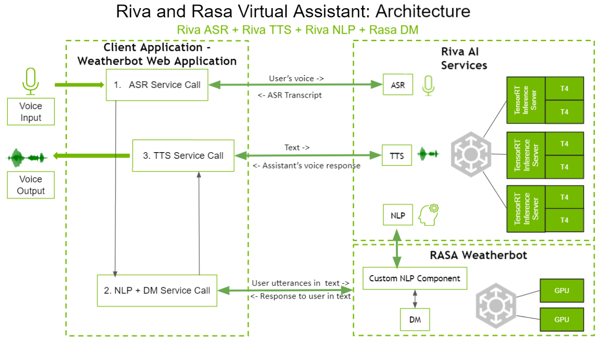
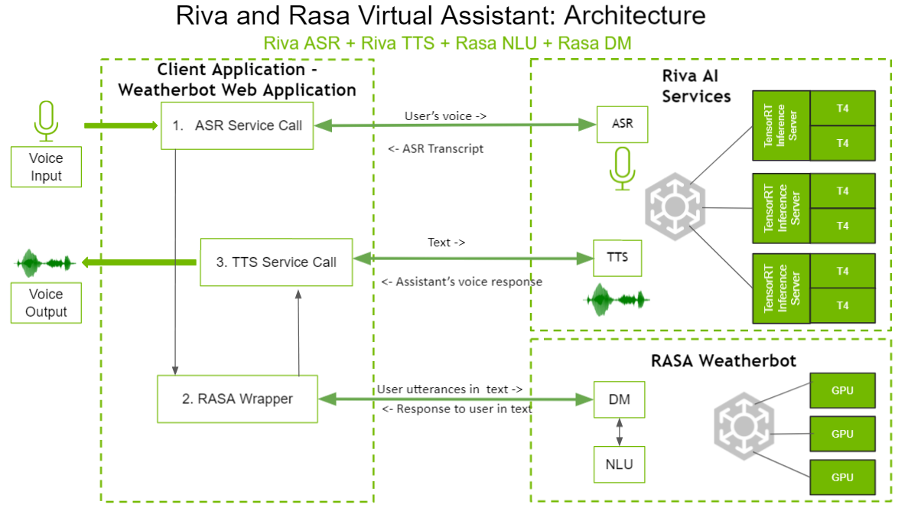

# Virtual Assistant (with Rasa)

This Virtual Assistant (with Rasa) sample application demonstrates the integration of Rasa and the Riva Speech Service in the form
of a weather chatbot web application. This sample is available in two options:

**Option 1:** Riva ASR + Riva TTS + Riva NLP + Rasa dialog manager

**Option 2:** Riva ASR + Riva TTS + Rasa NLU + Rasa dialog manager

To learn more about Rasa, follow [this link](https://rasa.com/).


## Demo Video

To see how the Riva weather chatbot service works, the demo video can be found [here](https://youtu.be/YCuilEpmlFI).


## Implementation

At a high-level, the integration takes advantage of the native API support of Rasa and gRPC support of Riva. The Weatherbot Client
coordinates the workflow with Riva Services and Rasa, then interacts with the end-user via a web UI.

- Container 1: Riva AI Services

  > - Exposes Speech Services (ASR/NLP/TTS) over gRPC endpoints
  > - Needs a GPU

- Container 2: Riva Samples' Riva-Rasa Chatbot

  > - Functionality
  >
  >   > - Exposes Rasa functionality over API endpoints. Responsible for dialog management with Rasa as well as NLP with Riva or
  >   >   NLU with Rasa
  >   > - Contains the Weatherbot Client application (web UI and web service)
  >
  > - Rasa
  >
  >   > - Up to two instances
  >   >
  >   >   > 1. Rasa Server
  >   >   > 2. Rasa Action (if applicable)
  >   >
  >   > - Does not need GPUs but can be deployed on GPUs for performance
  >
  > - Weatherbot Client
  >
  >   > - Includes the Riva Python library installed
  >   > - Communicates with Riva AI Services and Rasa over gRPC and REST API endpoints respectively
  >   > - Pipelines ASR, NLP, TTS, and dialog manager functionalities
  >   > - Does not need GPUs


### Architecture




### Code Structure

This section shows the high-level code structure of the Weatherbot Client (in `rasa-riva-weatherbot-webapp/riva` folder).

- `asr.py`

  > - This file contains the functionality to make the gRPC call to Riva ASR, using the Riva Python Client libraries, with the
  >   audio snippet, and returns the text transcript.
  > - ASR is used in streaming mode

- `rasa.py`

  > - This file contains the functionality to make an API call to Rasa, with the user input and sender ID, and returns a text
  >   response obtained by processing the Rasa response object.

- `tts.py` and `tts_stream.py`

  > - These files contain the functionality to make the gRPC call to Riva TTS, using the Riva Python Client libraries, with a
  >   text snippet, and returns the corresponding audio speech.
  > - TTS can be used in either `Batch` or `Streaming` mode, depending on whether `tts.py` or `tts\_stream.py` is used. This
  >   can be set by changing the import statements in lines 12 and 13 in `virtual-assistant-rasa/rasa-riva-weatherbot-webapp/riva/chatbot/chatbot.py`.

- `chatbot.py`

  > - This file contains the `Chatbot` class which is responsible for pipelining all the ASR, TTS, and Rasa operations.
  >
  > - Creates one instance of the `Chatbot` class per conversation.
  >
  > - Pipeline is as follows:
  >
  >   > - ASR is used in `Streaming` mode, therefore, it's a background operation. By default, we are listening to the audio of
  >   >   the user who is speaking into the microphone.
  >   > - ASR calls Rasa with the transcribed text either automatically when the user stops talking (when the `AutoSubmit` flag is
  >   >   enabled) or when the **Submit** button is hit.
  >   > - When called, Rasa internally calls Riva NLP or Rasa NLU with the transcribed text to fetch the intents and slots which
  >   >   is then used by the Rasa dialog manager to get the final response text. The response text is returned.
  >   > - TTS is automatically called with Rasa's response text, if `System Speech` is not muted.
  >   > - TTS gets the audio snippet and plays it back to the user on the speakers.


## Requirements and Setup

### Requirements:
Before you try running the Riva client, ensure you meet the following requirements:
1. You have access and are logged into NVIDIA NGC. For step-by-step instructions, refer to the [NGC Getting Started Guide](https://docs.nvidia.com/ngc/ngc-overview/index.html#registering-activating-ngc-account).
2. Python 3.8 (Support for other Python versions will be added in a future release).

### Setup:

1. Clone [Riva Sample Apps repository](https://github.com/nvidia-riva/sample-apps):
```bash
git clone https://github.com/nvidia-riva/sample-apps.git
```
2. Enter Riva and Rasa Virtual Assistant directory:
```bash
cd sample-apps/virtual-assistant-rasa
```
3. Create a parent directory for all Python virtual environments we will be using for this sample:
```bash
mkdir pythonenvs
```
4. Create Python virtual environment for Rasa text-based chatbot and install necessary libraries:
	1. Create and activate Python virtual environment for Rasa text-based chatbot:
	```bash
	python3 -m venv pythonenvs/rasa
	source pythonenvs/rasa/bin/activate
	```
	2. Upgrade `pip` and install Rasa dependencies. `requirements_rasa.txt` captures all the Python dependencies needed for Rasa text-based chatbot:
	```bash
	pip3 install -U pip
	pip3 install -r requirements_rasa.txt
	```
	3. Deactivate Rasa Python virtual environment:
	```bash
	deactivate
	```
5. Create Python virtual environment for Weatherbot web application, which uses Riva client, and install necessary libraries:
 	1. Create and activate Python virtual environment for Weatherbot web application:
	```bash
	python3 -m venv pythonenvs/client
	source pythonenvs/client/bin/activate
	```
	2. Upgrade `pip`:
	```bash
	pip3 install -U pip
	```
	3. Install Riva client libraries:		
	```bash
	pip install nvidia-riva-client
	```
	4. Install weatherbot web application dependencies. `requirements_client.txt` captures all other Python dependencies needed for weatherbot web application:
	```bash
	pip3 install -r requirements_client.txt # For Python 3.8
	```
	5. Deactivate Weatherbot web application's Python virtual environment:
	```bash
	deactivate
	```


## Running the Demo

1. Download the Riva Quick Start scripts, if not already done. `x.y.z` is the Riva Speech Skills version number - The latest Riva version number can be found in the [Riva Quick Start Guide](https://docs.nvidia.com/deeplearning/riva/user-guide/docs/quick-start-guide.html#)'s [Local Deploymnent using Quick Start Scripts section](https://docs.nvidia.com/deeplearning/riva/user-guide/docs/quick-start-guide.html#local-deployment-using-quick-start-scripts)
```bash
ngc registry resource download-version "nvidia/riva/riva_quickstart:x.y.z"
```

1. Start the Riva Speech Server, if not already done. Follow the steps in the [Riva Quick Start Guide](https://docs.nvidia.com/deeplearning/riva/user-guide/docs/quick-start-guide.html).

2. Navigate to the Riva and Rasa Virtual Assistant directory in the Riva sample-apps github repository that you cloned in the [Setup section](README.md#setup)'s, step 1.
```bash
cd sample-apps/virtual-assistant-rasa
```

3. Modify the API endpoint setting. There are two locations in the code base that have to be configured for inter-service communication:
	1. `rasa-weatherbot/endpoints.yml` for the IP address of the macine running Rasa Action server endpoint:
	```yaml
	# uncomment and populate the section below
	action_endpoint:
		url: "http://[rasa server host IP]:5055/webhook"
	```
	For example:
	```yaml
	# uncomment and populate the section below
	action_endpoint:
		url: "http://10.20.30.40:5055/webhook"
	```
	2. `config.py` for IP address of the machine running Riva Speech Skills server and IP address of the machine running Rasa chatbot server:
	```python
	# uncomment and populate the section below
	riva_config = {
		...
		"RIVA_SPEECH_API_URL": "[riva speech service host IP]:50051",
		...
	}

	# uncomment and populate the section below
	rasa_config = {
		...
		"RASA_API_URL": "[rasa server host IP]:5005",
		...
	}
	```
	For example:
	If the Riva Speech Skills Service and Rasa chatbot server are both running on the same machine, it would be:
	```python
	# uncomment and populate the section below
	riva_config = {
		...
		"RIVA_SPEECH_API_URL": "10.20.30.40:50051",
		...
	}
	# uncomment and populate the section below
	rasa_config = {
		...
		"RASA_API_URL": "10.20.30.40:5005",
		...
	}
	```
	If the Riva Speech Skills Service and Rasa chatbot server are running on different machines, it would be:
	```python
	# uncomment and populate the section below
	riva_config = {
		...
		"RIVA_SPEECH_API_URL": "10.20.30.40:50051",
		...
	}
	# uncomment and populate the section below
	rasa_config = {
		...
		"RASA_API_URL": "20.30.40.50:5005",
		...
	}
	```

4. Start the Rasa Action server.
	1. Open the `config.py` script. In the dictionary on the right side of the `riva_config` variable, update the `WEATHERSTACK_ACCESS_KEY` field with your Weatherstack API key. A new Weatherstack API key can be obtained [here](https://weatherstack.com/).
	2. Activate the Python virtual environment for Rasa text-based chatbot.
	```bash
	source pythonenvs/rasa/bin/activate
	```
	3. Navigate to the `rasa-weatherbot` directory.
	```bash
	cd rasa-weatherbot
	```
	4. Run the Rasa Action server.
	```bash
	rasa run actions --actions actions
	```

5. Start the Rasa server in a different terminal.
	1. Activate the Python virtual environment for Rasa text-based chatbot.
	```bash
	source pythonenvs/rasa/bin/activate
	```
	2. Navigate to the `rasa-weatherbot` directory.
	```bash
	cd rasa-weatherbot
	```
	3. Run the Rasa training.
		- For Riva NLP: Train the Rasa Core model.
		```bash
		rasa train -c config/config_rivanlp.yml -d domain/domain_rivanlp.yml --out models/models_rivanlp/ --data data/nlu_rivanlp.yml data/rules_rivanlp.yml data/stories_rivanlp.yml
		```
		- For Rasa NLU: Train the Rasa NLU and Rasa Core models.
		```bash
		rasa train -c config/config_rasanlp.yml -d domain/domain_rasanlp.yml --out models/models_rasanlp/ --data data/nlu_rasanlp.yml data/rules_rasanlp.yml data/stories_rasanlp.yml
		```
	4. Run the Rasa server.
		- For Riva NLP.
		```bash
		rasa run -m models/models_rivanlp/ --enable-api --log-file out.log --endpoints endpoints.yml
		```
		- For Rasa NLU.
		```bash
		rasa run -m models/models_rasanlp/ --enable-api --log-file out.log --endpoints endpoints.yml
		```

6. Start the Riva Chatbot server.
	1. Activate the Python virtual environment for the weather web application.
	```bash
	source pythonenvs/client/bin/activate
	```
	2. Navigate to the `rasa-riva-weatherbot-webapp` directory.
	```bash
	cd rasa-riva-weatherbot-webapp
	```
	3. Starting the Chatbot Client server.
	```bash
	python3 main.py
	```
	4. Open the web UI on a web browser.
	```
	https://[riva chatbot server host IP]:5555/rivaWeather
	```
	For example:
	```
	[https://0.0.0.0:5555/rivaWeather](https://0.0.0.0:5555/rivaWeather)
	```

## Sample Conversations

### Rasa NLU: Sample 1

**Virtual Assistant:** Hi, welcome to RIVA weather service. How can I help you?

**User:** How's the weather?

**Virtual Assistant:** For which location?

**User:** In Seattle.

**Virtual Assistant:** It is Haze, Smoke in Seattle at the moment. The temperature is 31 degrees, the humidity is 30 percent and the
wind speed is 20 miles per hour.

### Rasa NLU: Sample 2

**Virtual Assistant:** Hi, welcome to RIVA weather service. How can I help you?

**User:** How's the weather in Paris?

**Virtual Assistant:** It is Clear in Paris at the moment. The temperature is 20 degrees, the humidity is 73 percent and the wind
speed is 9 miles per hour.

### Rasa NLU: Sample 3

**Virtual Assistant:** Hi, welcome to RIVA weather service. How can I help you?

**User:** hi

**Virtual Assistant:** Hey! How are you?

**User:** who are you?

**Virtual Assistant:** I am a bot, powered by Rasa.

### Rasa NLU: Sample 4

**Virtual Assistant:** Hi, welcome to RIVA weather service. How can I help you?

**User:** Good Morning

**Virtual Assistant:** Hey! How are you?

**User:** I am doing great

**Virtual Assistant:** Great, carry on!

**User:** See you around

**Virtual Assistant:** Bye

### Riva NLP: Sample 1

**Virtual Assistant:** Hi, welcome to RIVA weather service. How can I help you?

**User:** How's the weather?

**Virtual Assistant:** For which location?

**User:** In Seattle.

**Virtual Assistant:** It is Haze, Smoke in Seattle at the moment. The temperature is 31 degrees, the humidity is 30 percent and the
wind speed is 20 miles per hour.

### Riva NLP: Sample 2

**Virtual Assistant:** Hi, welcome to RIVA weather service. How can I help you?

**User:** How's the weather in Paris?

**Virtual Assistant:** It is Clear in Paris at the moment. The temperature is 20 degrees, the humidity is 73 percent and the wind
speed is 9 miles per hour.

### Riva NLP: Sample 3

**Virtual Assistant:** Hi, welcome to RIVA weather service. How can I help you?

**User:** Is it raining in Austin?

**Virtual Assistant:** The precipitation is 0.4 inches in Austin at the moment.

**User:** What is the temperature in Toronto today?

**Virtual Assistant:** It is 4 degree celsius in Toronto at the moment.

## Limitations

- The provided samples are not complete virtual assistants, but are intended as simple examples of how to build basic task-oriented
  chatbots with Riva.  Consequently, the intent classifier and slot filling models have been trained with small amounts of data
  and are not expected to be highly accurate.
- The Rasa virtual assistant sample supports intents for weather, temperature, rain, humidity, sunny, cloudy and snowfall checks. It
  does not support general conversational queries or other domains.
- Both the Riva NLP and Rasa NLU samples support only 1 slot for city. Neither takes into account the day associated with the query.
- Although the Rasa servers and the chatbot servers can be hosted on different machines, the provided code does not support
  independent scaling of the servers.
- These samples support up to four concurrent users. This restriction is not because of Riva, but because of the web framework
  (Flask and Flask-ScoketIO) that is being used. The socket connection to stream audio to (TTS) and from (ASR) the user is unable to
  sustain more than four concurrent socket connections.
- The Rasa virtual assistant is not optimized for low latency in case of multiple concurrent users.
- Some erratic issues have been observed with the Rasa sample on the Firefox browser.  The most common issue is the TTS output being
  taken in as input by ASR for certain microphone gain values.

## License

The [NVIDIA Riva License Agreement](https://developer.nvidia.com/riva/ga/license) is included with the product. Licenses are also available along with the model application zip file. By pulling and using the Riva SDK container, downloading models, or using the sample applications here, you accept the terms and conditions of these licenses.   <br>
This project uses [Rasa](https://rasa.com/) and [Rasa-SDK](https://rasa.com/), the license information for which can be found below:
**Rasa:**
Licensed under the Apache License, Version 2.0. Copyright 2020 Rasa Technologies GmbH. Copy of the license can be found [here](https://github.com/RasaHQ/rasa/blob/main/LICENSE.txt).
**Rasa-SDK:**
Licensed under the Apache License, Version 2.0. Copyright 2020 Rasa Technologies GmbH. Copy of the license can be found [here](https://github.com/RasaHQ/rasa-sdk/blob/main/LICENSE.txt).
