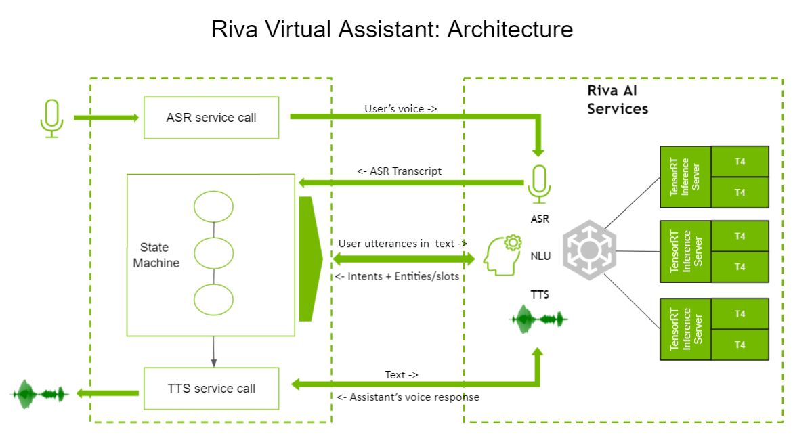
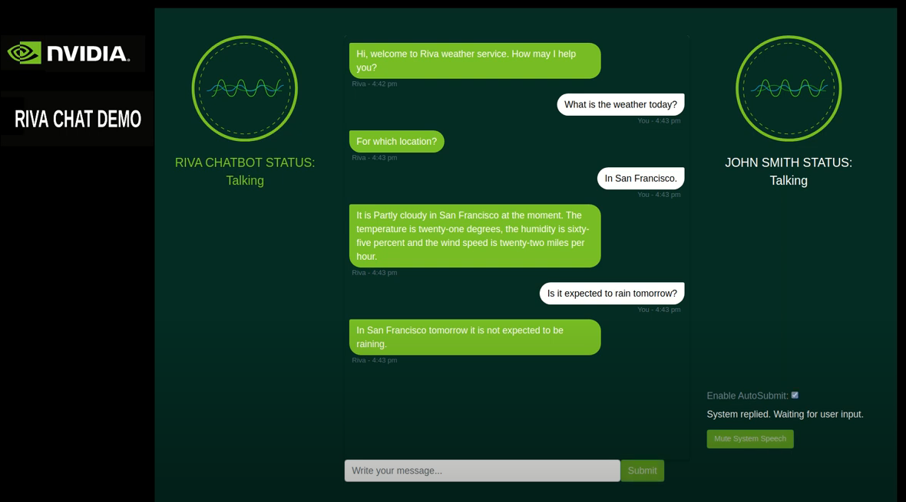

# Riva Virtual Assistant Example

## Overview

The Virtual Assistant sample demonstrates how to use Riva AI Services, specifically ASR, NLP, and TTS, to build a simple but complete conversational AI application. It demonstrates receiving input through speech from the user, interpreting the query using an intention recognition and slot-filling approach, computing a response, and speaking this back to the user in a natural voice.



This sample implements a dialog system with a state machine-based dialog state management approach, and using the intent/slot paradigm
for interpreting user queries. The provided model demonstrates conversational queries of weather, temperature, and rainfall by
geography and time, using a free web service as the fulfillment engine to return real weather data. While narrow in scope, it
includes all of the components that make up more sophisticated and complete dialog systems such as those deployed on phones or in-home
virtual assistants.

The dialog manager is an environment that executes a state machine, and is integrated with Riva NLP, ASR, and TTS modules. This sample could be modified to implement more models and more complex dialog state management. It is also intended to demonstrate
how Riva can be integrated into the existing virtual assistant and dialog systems to provide state-of-the-art conversational
intelligence optimized for NVIDIA’s accelerated computing platform.

It is possible, through the design of different dialog state diagrams to create different types of assistants. As a sample, we provide an
implementation of a **weather** bot.



## Video Demo

[Here is a video](https://youtu.be/SUnepNejPDA) that shows the weather bot in action and then discusses the high-level
description of the architecture followed by a very brief code walkthrough.

## Requirements and Setup


###  Pre-requisites

1. You have access and are logged into NVIDIA NGC. For step-by-step instructions, refer to the [NGC Getting Started Guide](https://docs.nvidia.com/ngc/ngc-overview/index.html#registering-activating-ngc-account).

2. Setting up Riva services is a prerequisite as the various components of the application depends on the availability of those servies. The weather bot assumes the availablity of the following models at the Riva endpoint – ASR, TTS, NLP (weather domain intent & slot model). After you have the Riva services up and running, only then proceed with running this application.

3. Python 3.8 (Support for other Python versions will be added in a future release).

4. [`virtualenv`](https://virtualenv.pypa.io/en/latest/) tool to create a Python environment.
```bash
pip install virtualenv
```

### Setup

1. Clone [Riva Sample Apps repository](https://github.com/nvidia-riva/sample-apps)
```bash
git clone https://github.com/nvidia-riva/sample-apps.git
```
2. Enter Riva Virtual Assistant directory:
```bash
cd sample-apps/virtual-assistant
```

3. Create and enable a Python [virtual environment](https://virtualenv.pypa.io/en/latest/).
```bash
virtualenv -p python3 apps-env
source apps-env/bin/activate
```

4. Install the libraries necessary for the virtual assistant, including the Riva client library:
    1. Upgrade [`pip`](https://pip.pypa.io/en/stable/):
	```bash
	pip3 install -U pip
	```
	2. Install Riva client libraries:
		1. Download the Riva Quick Start scripts, if not already done. `x.y.z` is the Riva Speech Skills version number - The latest Riva version number can be found in the [Riva Quick Start Guide](https://docs.nvidia.com/deeplearning/riva/user-guide/docs/quick-start-guide.html#)'s [Local Deploymnent using Quick Start Scripts section](https://docs.nvidia.com/deeplearning/riva/user-guide/docs/quick-start-guide.html#local-deployment-using-quick-start-scripts)
		```
		ngc registry resource download-version "nvidia/riva/riva_quickstart:x.y.z"
		```
		2. Install the Riva client library.
		```
		cd riva_quickstart_v<x.y.z>
		pip install riva_api-<x.y.z>-py3-none-any.whl
		```
	3. Install weatherbot web application dependencies. `requirements.txt` captures all Python dependencies needed for weatherbot web application.
	```bash
	pip3 install -r requirements.txt # For Python 3.8
	```

### Running the demo
1.  Start the Riva Speech Server, if not already done. Follow the steps in the [Riva Quick Start Guide](https://docs.nvidia.com/deeplearning/riva/user-guide/docs/quick-start-guide.html).

2. Edit the configuration file [config.py](./config.py), and set:
    * The Riva speech server URL. This is the endpoint where the Riva services can be accessed.
    * The [weatherstack API access key](https://weatherstack.com/documentation). The VA uses weatherstack for weather fulfillment, that is when the weather intents are recognized, real-time weather information is fetched from weatherstack. Sign up to the free tier of [weatherstack](https://weatherstack.com/), and get your API access key.

The code snippet will look like the example below.
```python3
riva_config = {
  "RIVA_SPEECH_API_URL": "<IP>:<PORT>", # Replace the IP & port with your hosted Riva endpoint
   ...
  "WEATHERSTACK_ACCESS_KEY": "<API_ACCESS_KEY>",  # Get your access key at - https://weatherstack.com/
   ...
}
```

3. Run the virtual assistant application
```bash
python3 main.py
```

4. Open the browser to **https://IP:8009/rivaWeather**, where the IP is for the machine where the application is running. For instance, go to <https://127.0.0.1:8009/rivaWeather/> for local machine.

## Sample Use Cases
It is possible to ask the bot the following types of questions:

* What is the weather in Berlin?

* What is the weather?
    * For which location?

* What’s the weather like in San Francisco tomorrow?
    * What about in California City?

* What is the temperature in Paris on Friday?

* Is it currently cold in San Francisco?

* Is it going to rain in Detroit tomorrow?

* How much rain in Seattle?

* Will it be sunny next week in Santa Clara?

* Is cloudy today?

* Is it going to snow tomorrow in Milwaukee?

* How much snow is there in Toronto currently?

* How humid is it right now?

* What is the humidity in Miami?

## Limitations
* The provided sample is not complete chatbots, but is intended as simple examples of how to build basic task-oriented chatbots with Riva. Consequently, the intent classifier and slot filling model have been trained with small amounts of data and are not expected to be highly accurate.
* The Riva NLP sample supports intents for weather, temperature, rain, humidity, sunny, cloudy and snowfall checks. It does not support general conversational queries or other domains.
* The Riva NLP sample supports only 1 slot for city. It also does not take into account the day associated with the query.
* The sample supports up to four concurrent users. This restriction is not because of Riva, but because of the web framework (Flask and Flask-ScoketIO) that is being used. The socket connection is to stream audio to (TTS) and from (ASR); you are unable to sustain more than four concurrent socket connections.
* The chatbot application is not optimized for low latency in the case of multiple concurrent users.
* Some erratic issues have been observed with the chatbot sample on the Firefox browser. The most common issue is the TTS output being taken in as input by ASR for certain microphone gain values.

## License
The [NVIDIA Riva License Agreement](https://developer.nvidia.com/riva/ga/license) is included with the product. Licenses are also available along with the model application zip file. By pulling and using the Riva SDK container, downloading models, or using the sample applications here, you accept the terms and conditions of these licenses.   <br>
